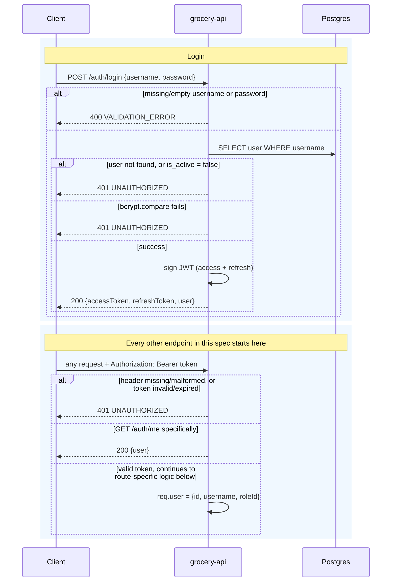
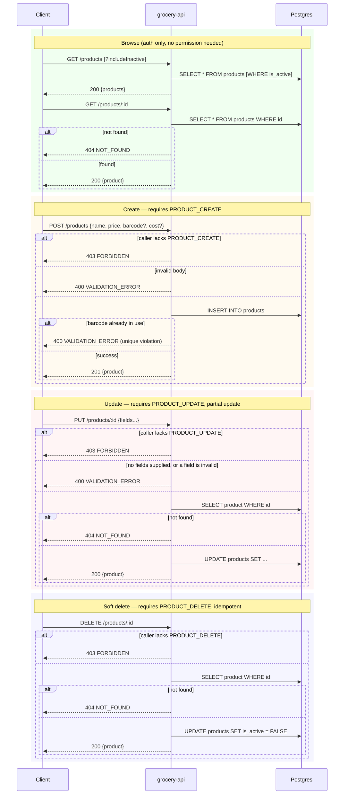
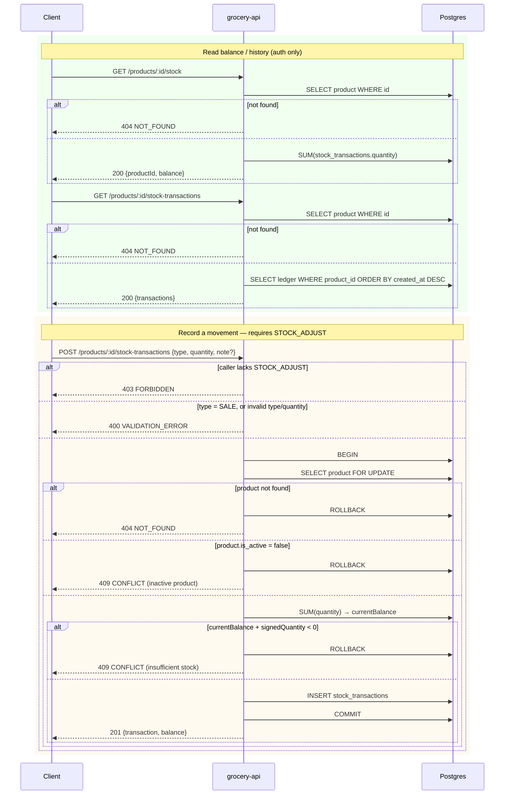
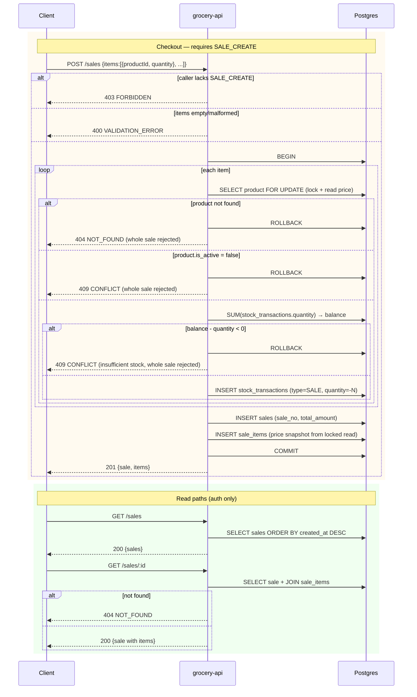
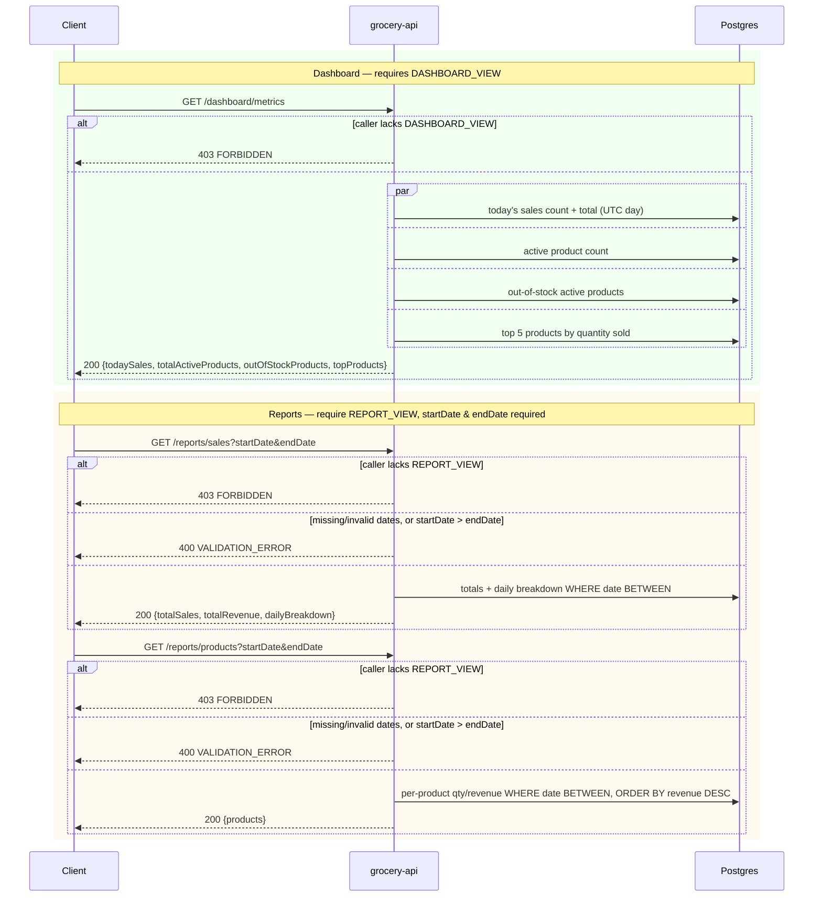

# Grocery POS — Diagrams

Architecture/relationship and sequence diagrams for `grocery-api`. Split
out from `docs/hld-api-spec.md` to keep the API reference (request/
response shapes, status codes, `curl` examples) separate from the
visual/behavioral design. For endpoint-by-endpoint detail — request
bodies, error codes, permission codes — see the HLD (API Spec).

---

## 1. API Relationship Diagram

How the endpoint groups depend on each other and on the underlying
tables:

```mermaid
flowchart TD
    Login["POST /auth/login"] --> Token(["JWT access + refresh token"])
    Token -->|Bearer required| Me["GET /auth/me"]
    Token -->|Bearer required| Products
    Token -->|Bearer required| Stock
    Token -->|Bearer required| Sales
    Token -->|Bearer required| Dashboard["GET /dashboard/metrics"]
    Token -->|Bearer required| Reports

    subgraph Products["Products"]
        direction TB
        PList["GET /products"]
        PGet["GET /products/:id"]
        PCreate["POST /products"]
        PUpdate["PUT /products/:id"]
        PDelete["DELETE /products/:id"]
    end

    subgraph Stock["Inventory"]
        direction TB
        SBalance["GET /products/:id/stock"]
        SList["GET /products/:id/stock-transactions"]
        SCreate["POST /products/:id/stock-transactions"]
    end

    subgraph Sales["Sales"]
        direction TB
        SaCreate["POST /sales"]
        SaList["GET /sales"]
        SaGet["GET /sales/:id"]
    end

    subgraph Reports["Reports"]
        direction TB
        RSales["GET /reports/sales"]
        RProducts["GET /reports/products"]
    end

    ProductsTbl[("products")]
    StockTbl[("stock_transactions")]
    SalesTbl[("sales")]
    SaleItemsTbl[("sale_items")]

    PCreate -.writes.-> ProductsTbl
    PUpdate -.writes.-> ProductsTbl
    PDelete -.soft-delete.-> ProductsTbl
    SCreate -.locks + reads.-> ProductsTbl
    SCreate -.writes.-> StockTbl
    SBalance -.SUM quantity.-> StockTbl

    SaCreate -.locks + reads price.-> ProductsTbl
    SaCreate -.writes SALE-type row.-> StockTbl
    SaCreate -.writes.-> SalesTbl
    SaCreate -.writes.-> SaleItemsTbl

    Dashboard -.aggregates.-> SalesTbl
    Dashboard -.aggregates.-> ProductsTbl
    Dashboard -.aggregates.-> StockTbl
    RSales -.aggregates.-> SalesTbl
    RProducts -.aggregates.-> SaleItemsTbl
```

---

## 2. Sequence Diagrams

One sequence diagram per domain, each covering **every** success and
error branch documented for its endpoints (400/401/403/404/409) — not
just the happy path. `alt`/`par` blocks show every user case; `C` =
Client, `API` = grocery-api, `DB` = Postgres. Bearer-token validation
(`401` on missing/invalid/expired token) is identical on every
authenticated call and shown once in §2.1 rather than repeated in every
later diagram.

### 2.1 Authentication — `POST /auth/login`, `GET /auth/me`

### 2.2 Products — CRUD

### 2.3 Inventory (Stock)

### 2.4 Sales (Checkout)

The most consequential multi-table interaction in the system — every
item in one sale shares a single DB transaction, so any item's failure
rolls back the entire sale, including stock already deducted for earlier
items in the same request.

### 2.5 Dashboard & Reports

